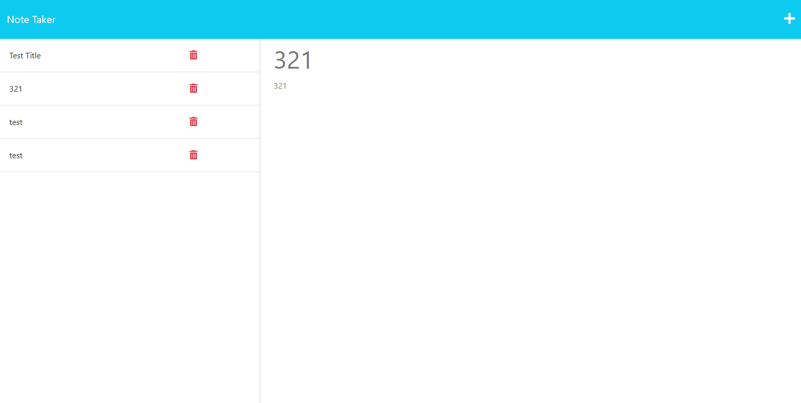

# Workday Planner

## Technology Used 

| Technology Used         | Resource URL           | 
| ------------- |:-------------:| 
| HTML    | [https://developer.mozilla.org/en-US/docs/Web/HTML](https://developer.mozilla.org/en-US/docs/Web/HTML) | 
| CSS     | [https://developer.mozilla.org/en-US/docs/Web/CSS](https://developer.mozilla.org/en-US/docs/Web/CSS)      |   
| Git | [https://git-scm.com/](https://git-scm.com/)     |  
|JavaScript | [https://developer.mozilla.org/en-US/docs/Web/JavaScript](https://developer.mozilla.org/en-US/docs/Web/JavaScript)     |
HEROKU | [https://www.heroku.com/](https://www.heroku.com/)     |
Node.js | [https://nodejs.org/en/](https://nodejs.org/en/)     |
Express.js | [https://expressjs.com/](https://expressjs.com/)     |

## Description 
This application is a Note Taker. It allows users to write notes and store them. I used HEROKU, Node, Express.js, JavaScipt, HTML, CSS, and GIT. 

Here is the USER STORY:
AS A small business owner
I WANT to be able to write and save notes
SO THAT I can organize my thoughts and keep track of tasks I need to complete.

I did this by using the existing code. I installed the required packages, and then created a server.js file, and coded the backend of the website I then deployed the site to HEROKU. 

[Visit the Deployed Site](https://git.heroku.com/morning-dusk-39844.gitng-dusk-39844.git)

## Usage 

To use this website, simply visit the deployed site. You can then click on the "Get Started" button to begin. You can then enter a title and text for your note. Once you have entered the information, you can click the save button in the top right corner. You can then click on the note in the left column to view it. You can also click on the trash can icon to delete the note.

## Author Info

### Luke Harriman

* [Github](https://github.com/lth1013)